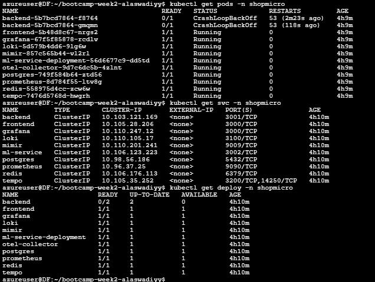
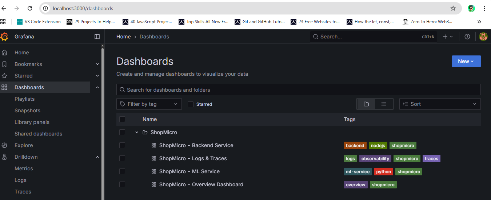
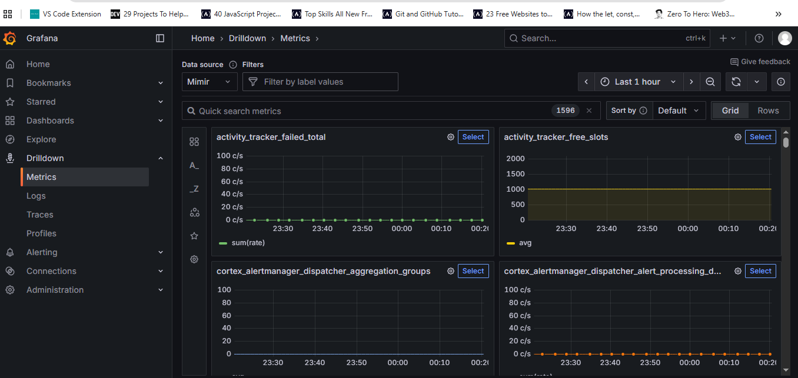
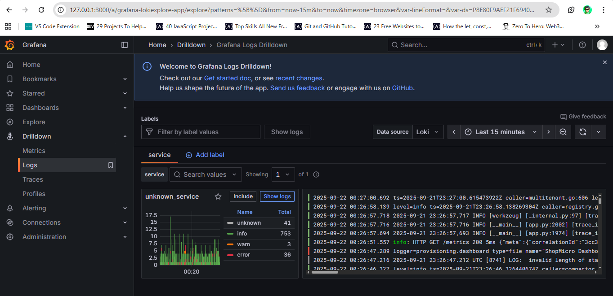
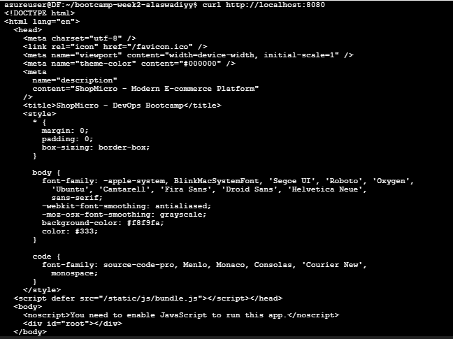

### **Verify my deployment**

---

- `kubectl get pods -n shopmicro`

- `kubectl get svc -n shopmicro`

- `kubectl get deploy -n shopmicro`

### **Open Grafana:**

- Grafana: <http://localhost:3000>
 (login: admin / admin)

**Grafana dashboard**

**Metrics on grafana**

**logs on grafana**

### **Open Prometheus UI:**

 `http://localhost:9090`

**Prometheus**

(./images/prometheus.png)

### **Test Service Connectivity:**

- **Test backend health:**

  `curl http://localhost:3001/health`

  

- **Test frontend health:**

`curl http://localhost:8080`

